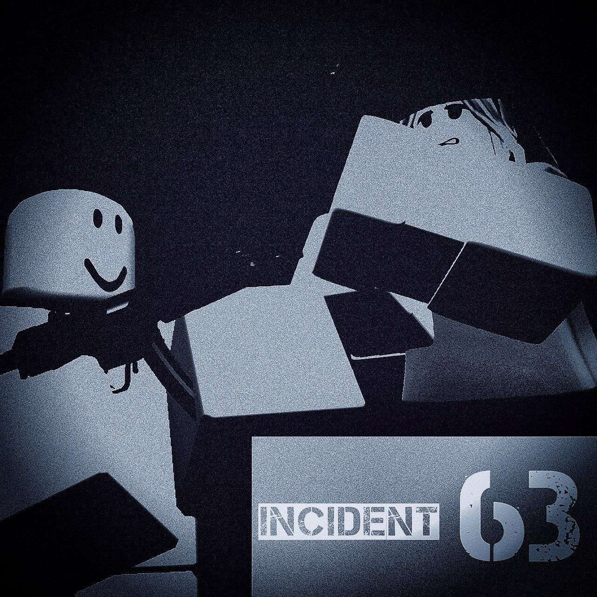

# INCIDENT 63 | PVE Base Defense Roblox Game

  
  
  
  
  

---

## Overview

**INCIDENT 63** is the base-defense game on Roblox. Team up with friends or go solo to survive waves of R63.

---

## Key Features

- **Diverse Armory**: Rifles, rocket launchers, melee weapons
- **Base Building**: Walls, turrets, landmines — customize your defense
- **Unique R63 Enemies**: Riflemans, rocket launchers, grenadiers and melee.
- **Progression System (TO BE IMPLEMENTED)**: Levels & research tree
- **Multiplayer**: Play with up to 50 players
- **Boss (TO BE IMPLEMENTED)**
- **Special Modes (TO BE IMPLEMENTED)**: Open world.
- **High quality weapon animations**

---

## Tech Stack & Tools

- **Engine**: Roblox Studio (latest)
- **Language**: Lua (Module Scripts & OOP Patterns)
- **Art & Animation**: Blender
- **Audio**: FLStudio, audacity

---

## 📅 Roadmap

| Quarter   | Planned Updates                                         |
| :-------- | :------------------------------------------------------ |
| Q3 2025   | Cosmetic Shop, Volcanic Island Map 🌋, PvP Tournaments 🏆 |
| Q4 2025   | Space Station Zero‑G Level 🌌, Mechs & Vehicle Combat 🚗 |
| 2026      | Mobile Support 📱, Guild System & Clan Wars ⚔️, Story Mode 📖 |

---

## FAQs

**Q: Can I play solo?**  
A: Yes, but that will be very hard

**Q: How to report bugs?**  
A: You can report bugs on our discord server

---

## Team & Credits

| Developer      | Role                                        |
| -------------- | ------------------------------------------- |
| ⭐ Старый       | Lead Dev, Game Logic, Weapon Systems        |
| 🎨 Teammate1   | UI/UX, Art & Animations                     |
| 🎵 Teammate2   | Audio Engineering, Soundtrack & FX          |
| 🕹️ Teammate3   | Wave Design, AI Behavior, Balance           |

---

## Play & Connect

- **Play Now:** https://www.roblox.com/ 
- **Discord:** https://discord.gg/ 

---

