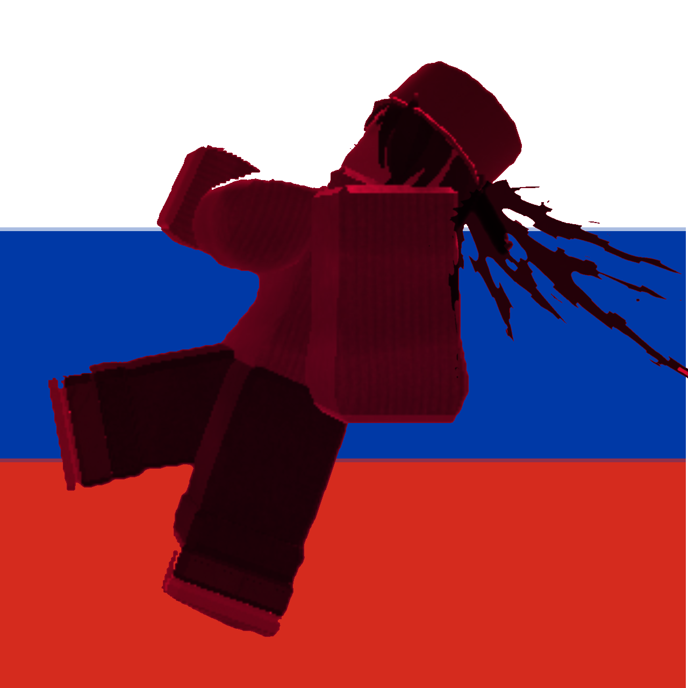

# 💥 KILL R63 🔫 | Base Defense Roblox Game 💥

  
  
  
  
  
  

---

## ⚔️ Epic Overview

**Kill R63** is the ultimate base-defense game on Roblox! 🔥 Team up with friends or go solo to survive waves of wild, over-the-top R63 clones 👯‍♂️👹 trying to demolish your fortress! Strategize, build, and blast through chaos to claim your victory! 💣💥

> 🧠 **Think fast**, 🏗️ **build faster**, and 💪 **fight hardest**!

---

## 🚀 Key Features ✨

- 🔫 **Diverse Armory**: Rifles, shotguns, lasers, rockets & more!
- 🏰 **Base Building**: Walls, turrets, traps — customize your defense!
- 🧟 **Unique R63 Enemies**: Zombies, ninjas, robots, and surprise minibosses!
- 🆙 **Progression System**: Level up, unlock skill trees & perks!
- 💎 **Loot & Cosmetics**: Skins, emotes, hats — stand out on the battlefield!
- 🎉 **Seasonal Events**: Summer Splash, Spooky Halloween, Winter Wonderland!
- 🌐 **Multiplayer Madness**: Co‑op up to 8 players, PvP duels & free‑for‑all!
- ⚔️ **Boss Encounters**: Face gargantuan R63 bosses with epic mechanics!
- 🌌 **Special Modes**: Endless Survival, Time Rush, Hardcore Challenge!
- 💰 **In-Game Shop**: Mystery crates, battle passes & exclusive bundles!
- 🔊 **Immersive Audio**: Dynamic soundtrack & 3D spatial FX!
- 💥 **Visual Spectacle**: Particle explosions, interactive weather & lighting!

---

## 🖼️ Visual Showcase

| Turrets Preview | Enemy Horde | Boss Showdown |
| :-------------: | :---------: | :-----------: |
|  |  |  |

---

## 🛠️ Tech Stack & Tools

- **Engine**: Roblox Studio (latest)
- **Language**: Lua (Module Scripts & OOP Patterns)
- **Version Control**: Git & GitHub
- **CI/CD**: Roblox CLI Automated Builds & Tests
- **Art & Animation**: Blender & Custom Particle Systems
- **Audio**: FMOD Integration
- **Project Management**: Trello, Discord Bots & Kanban Boards

---

## 🎮 Getting Started

1. **Install Roblox** and create or log in to your account.
2. **Search** for "Kill R63" in the Roblox game library.
3. **Join** a server or **host** a private match.
4. **Complete** the first 3 tutorial waves for starting credits.
5. **Build** defenses: walls 🧱, turrets 🔰, traps ⚡.
6. **Purchase** weapons 🔫, upgrades 🆙, and cosmetic items 👕.
7. **Coordinate** with teammates via chat & ping system.
8. **Survive** waves, conquer bosses, and top the leaderboards!

> 💡 **Pro Tip**: Combine turret abilities—freeze & cannon for optimal crowd control!

---

## 📅 Roadmap

| Quarter   | Planned Updates                                         |
| :-------- | :------------------------------------------------------ |
| Q3 2025   | Cosmetic Shop, Volcanic Island Map 🌋, PvP Tournaments 🏆 |
| Q4 2025   | Space Station Zero‑G Level 🌌, Mechs & Vehicle Combat 🚗 |
| 2026      | Mobile Support 📱, Guild System & Clan Wars ⚔️, Story Mode 📖 |

---

## 🙋 FAQs

**Q: Can I play solo?**  
A: Yes! Solo mode helps you practice before teaming up. 🎮

**Q: Are there microtransactions?**  
A: Only cosmetic—no pay‑to‑win. 💎

**Q: How to report bugs?**  
A: Open an issue tagged "bug" here on GitHub or ping us on Discord. 🐛

**Q: How can I contribute?**  
A: Read [CONTRIBUTING.md](./CONTRIBUTING.md) for guidelines & submit a pull request. 🤝

---

## 🤝 Contributing & Code of Conduct

We welcome all contributors:
1. Fork the repo 🍴
2. Create a feature or bugfix branch 🌿
3. Commit with clear messages 📝
4. Open a Pull Request 🚀

Please follow our [CODE_OF_CONDUCT.md](./CODE_OF_CONDUCT.md). 💖

---

## 👩‍💻 Team & Credits

| Developer      | Role                                        |
| -------------- | ------------------------------------------- |
| ⭐ Старый       | Lead Dev, Game Logic, Weapon Systems        |
| 🎨 Teammate1   | UI/UX, Art & Animations                     |
| 🎵 Teammate2   | Audio Engineering, Soundtrack & FX          |
| 🕹️ Teammate3   | Wave Design, AI Behavior, Balance           |

---

## 🌐 Play & Connect

- **Play Now:** https://www.roblox.com/ 
- **Discord:** https://discord.gg/ 
- **Twitter:** https://twitter.com/

---

## 📜 License

Licensed under MIT. See [LICENSE.md](./LICENSE.md).

---

*Brace yourselves: the R63 wave is unstoppable!*

